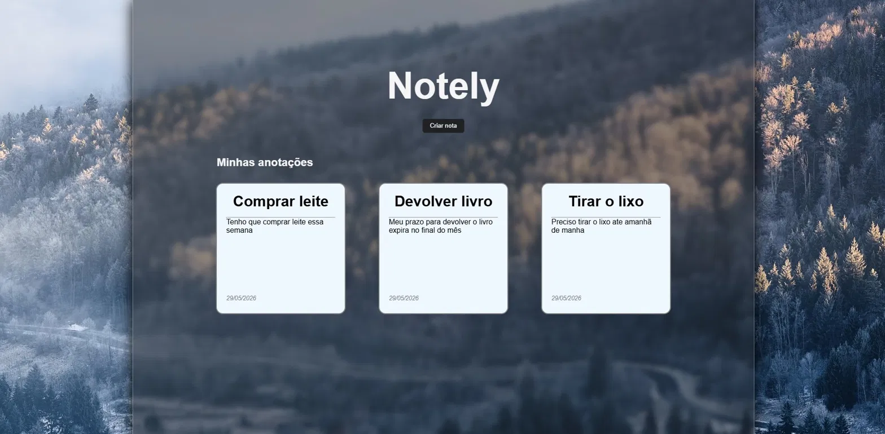
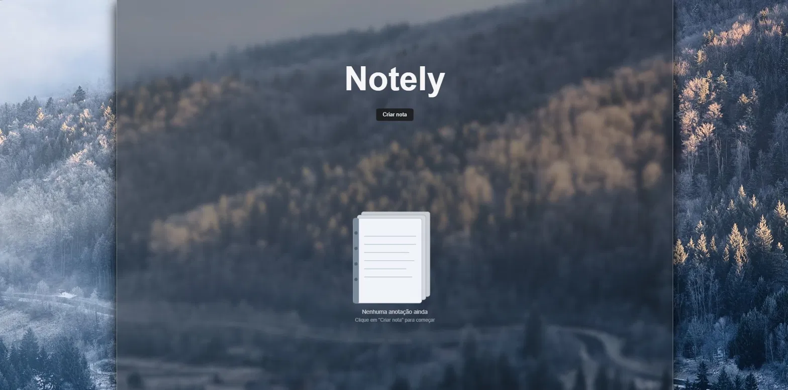
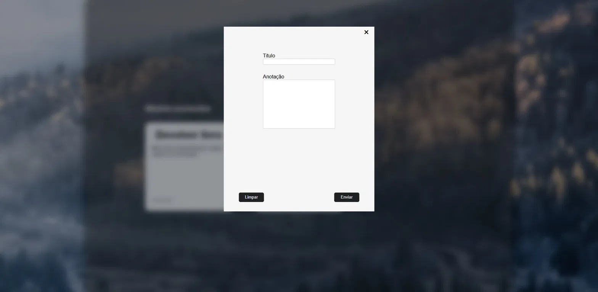

# Notely

Bloco de notas minimalista com design clean e fundo atmosférico. Crie, edite e delete suas anotações com persistência local — tudo sem frameworks, sem dependências.



---

## Funcionalidades

- Criar, editar e deletar anotações
- Persistência de dados com localStorage
- Modal de confirmação antes de deletar
- Estado vazio com ilustração quando não há anotações
- Notas ordenadas da mais recente para a mais antiga
- Design responsivo para mobile, tablet, notebook e desktop

---

## Screenshots

| Estado vazio | Criando uma nota |
|---|---|
|  |  |

---

## Tecnologias

- HTML5
- CSS3
- JavaScript Vanilla (sem frameworks ou bibliotecas)

---

## O que esse projeto demonstra

- Manipulação do DOM com `createElement`, `appendChild` e `prepend`
- Gestão de estado com array em memória sincronizado com `localStorage`
- Separação de responsabilidades em funções reutilizáveis
- Prevenção de XSS usando `textContent` em vez de `innerHTML`
- Design responsivo com media queries e CSS Grid
- Boas práticas de escopo e ciclo de vida de event listeners

---

## Como rodar localmente

```bash
git clone https://github.com/LeonardoOrphali/to-do-list.git
cd to-do-list
```

Abra o `index.html` no navegador. Nenhuma instalação necessária.

---

## Demo

[Acessar o Notely]( https://leonardoorphali.github.io/Notely/)

---

Desenvolvido por [Leonardo Orphali](https://github.com/LeonardoOrphali)
